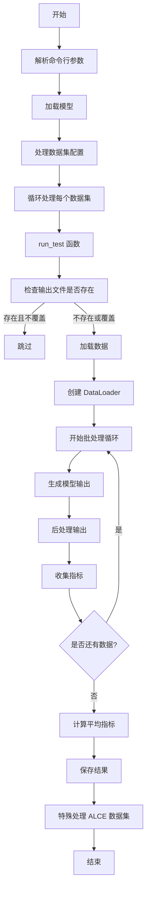

让我详细解释 `eval.py` 的结构和流程：

1. **主要功能**
- 加载模型和数据
- 运行测试评估
- 收集和保存结果
- 支持多数据集评估

2. **核心函数**
- `main()`: 程序入口，处理参数和运行评估
- `run_test()`: 执行具体的测试评估流程

3. **详细流程图**



4. **详细代码解释**

```python:eval.py
# 主要配置和初始化
def main():
    # 1. 初始化配置
    args = parse_arguments()
    
    # 2. 加载模型
    model = load_LLM(args)
    
    # 3. 处理多数据集配置
    datasets = args.datasets.split(",")
    test_files = args.test_files.split(",")
    demo_files = args.demo_files.split(",")
    
    # 4. 循环处理每个数据集
    for dataset, test_file, demo_file, max_length, gen_length in zip(...):
        # 更新参数
        args.datasets = dataset
        # ... 运行测试
        output_path = run_test(args, model, dataset, test_file, demo_file)
```

```python:eval.py
# 测试执行函数
def run_test(args, model, dataset, test_file, demo_file):
    # 1. 输出路径处理
    output_path = os.path.join(args.output_dir, f"{dataset}_{tag}...")
    
    # 2. 数据加载
    data = load_data(args, dataset, test_file, demo_file)
    
    # 3. 创建数据加载器
    dataloader = DataLoader(TestItemDataset(data, model, model.tokenizer), ...)
    
    # 4. 执行推理
    with torch.inference_mode():
        for idx, inputs in enumerate(tqdm(dataloader)):
            # 生成输出
            output = model.generate(inputs=inputs)
            
            # 后处理
            mets, others = data['post_process'](output, test_item)
            
            # 收集结果
            metrics[k].append(v)
            
    # 5. 计算和保存结果
    averaged_metrics = {...}
    output = {
        "args": args.__dict__,
        "data": results,
        "metrics": metrics,
        ...
    }
```

5. **关键特性**
- 支持多种数据集评估
- 灵活的模型配置
- 详细的日志记录
- 错误处理和恢复
- 结果缓存和复用
- 性能监控（内存使用、吞吐量）

6. **输出内容**
- 详细的评估指标
- 原始预测结果
- 性能统计
- 错误日志
- 特定数据集的额外评估（如 ALCE）

这个评估框架设计得非常灵活和健壮，可以处理各种不同的评估场景和数据集。
