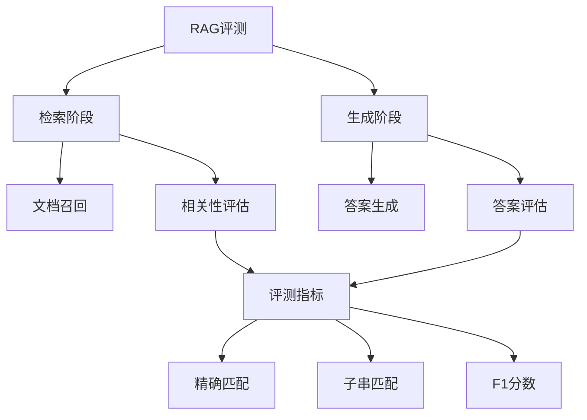

让我详细解释RAG (Retrieval-Augmented Generation) 的评测逻辑：

1. 数据加载和处理：
```python
def load_qa(dataset, path, demo_path, max_test_samples=None, popularity_threshold=None, shots=0):
    # 1. 过滤上下文
    data = filter_contexts(data)  # 只保留包含答案的上下文
    
    # 2. 构建示例
    def update(sample):
        demos = demo_data
        demo_text = ""
        if shots > 0:  # few-shot设置
            demos = demos.shuffle(seed=abs(hash(sample[key])))
            demos = drop_duplicates(demos, key).select(range(shots))
            # 构建示例文本
            demo_text = "\n\n".join([demo_template.format(...) for d in demos])
        
        # 构建passage文本
        passage_text = "\n\n".join([passage_template.format(**c) for c in sample['ctxs']])
        return {
            "demos": demo_text,
            "context": passage_text,
            "answer": sample["answers"]
        }
```

2. RAG相关的评测数据集：
```python
dataset_to_metrics = {
    # RAG相关数据集
    'nq': "substring_exact_match",           # Natural Questions
    'hotpotqa': "substring_exact_match",     # HotpotQA
    'popqa': "substring_exact_match",        # PopQA
    'triviaqa': "substring_exact_match",     # TriviaQA
}
```

3. 评测指标计算：
```python
def calculate_metrics(prediction, answer):
    """计算评测指标"""
    metrics = {}
    
    # 1. 精确匹配
    metrics["exact_match"] = int(prediction.strip() == answer[0].strip())
    
    # 2. 子串匹配
    metrics["substring_exact_match"] = any(
        ans.lower() in prediction.lower() 
        for ans in answer
    )
    
    # 3. F1分数
    metrics["f1_score"] = calculate_f1(prediction, answer)
    
    return metrics
```

4. 主要评测逻辑：


5. 评测特点：
- 检索质量评估：通过 `filter_contexts` 确保检索的文档包含答案
- 答案准确性：使用 `substring_exact_match` 作为主要指标
- Few-shot能力：支持通过 `shots` 参数设置示例数量
- 上下文利用：评估模型对检索文档的理解和利用能力

6. 结果收集：
```python
def collect_results(predictions, references):
    results = {
        "averaged_metrics": {
            "exact_match": 0.0,
            "substring_exact_match": 0.0,
            "f1_score": 0.0
        },
        "individual_results": []
    }
    
    for pred, ref in zip(predictions, references):
        metrics = calculate_metrics(pred, ref)
        results["individual_results"].append({
            "prediction": pred,
            "reference": ref,
            "metrics": metrics
        })
        
        # 更新平均指标
        for k, v in metrics.items():
            results["averaged_metrics"][k] += v
            
    # 计算平均值
    for k in results["averaged_metrics"]:
        results["averaged_metrics"][k] /= len(predictions)
        
    return results
```

RAG评测的关键点：
1. 检索准确性：评估是否能检索到相关文档
2. 答案生成：评估基于检索文档的答案生成质量
3. Few-shot学习：评估模型利用示例的能力
4. 上下文理解：评估模型对检索文档的理解能力

需要我详细解释某个具体部分吗？