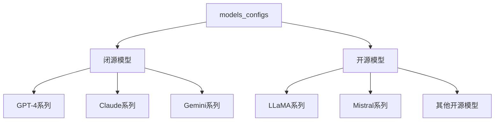

`models_configs` 是一个模型配置列表，定义了所有需要评测的模型及其配置参数。让我详细解释：




具体配置示例：

1. 闭源模型配置：
```python
# GPT-4系列
{
    "model": "gpt-4-0125-preview",
    "use_chat_template": True,      # 使用聊天模板
    "training_length": 128000       # 训练长度
},
{
    "model": "claude-3-5-sonnet-20240620",
    "use_chat_template": True,
    "training_length": 200000
}
```


2. 开源模型配置：
```python
# LLaMA系列
{
    "model": "LLaMA-2-7B-32K",
    "use_chat_template": False,    # 不使用聊天模板
    "training_length": 32768       # 训练长度
},
# Mistral系列
{
    "model": "Mistral-7B-v0.1",
    "use_chat_template": False,
    "training_length": 8192
}
```


3. 使用场景：
```python
# 在评测循环中使用
for model in models_configs:
    args = arguments()
    args.tag = "v1"
    args.output_dir = f"output/{model['model']}"  # 设置输出目录
    
    # 更新模型相关配置
    args.update(model)  # 应用模型特定的配置
    
    # 进行评测...
```


主要作用：

1. 模型定义：
```python
# 定义要评测的所有模型
models_configs = [
    # 1. 闭源模型
    {"model": "gpt-4", ...},
    {"model": "claude", ...},
    
    # 2. LLaMA系列
    {"model": "llama-2-7b", ...},
    {"model": "llama-3-8b", ...},
    
    # 3. Mistral系列
    {"model": "mistral-7b", ...},
    
    # 4. 其他模型
    {"model": "phi-3", ...},
    {"model": "qwen-7b", ...}
]
```


2. 配置管理：
```python
# 每个模型的关键配置
{
    "model": "模型名称",
    "use_chat_template": True/False,  # 是否使用聊天模板
    "training_length": 数值,          # 训练长度限制
    # 其他可能的配置...
}
```


3. 评测控制：
- 统一管理所有模型
- 控制评测范围
- 设置模型特定参数
- 便于批量处理

这种设计的优点：
1. 集中管理所有模型配置
2. 便于添加/删除模型
3. 支持模型特定的配置
4. 方便批量评测

需要我详细解释某个具体部分吗？