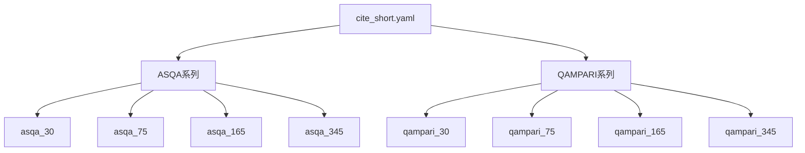

`cite_short.yaml` 中的 datasets 定义了一系列引用任务的评测数据集配置。让我解析它们的关系：



具体关系：

1. 数据集命名规则：
```python
datasets = [
    # ASQA系列 - 不同上下文长度
    "alce_asqa_30",   # 30表示上下文窗口大小
    "alce_asqa_75",   # 75表示上下文窗口大小
    "alce_asqa_165",  # 165表示上下文窗口大小
    "alce_asqa_345",  # 345表示上下文窗口大小
    
    # QAMPARI系列 - 不同上下文长度
    "alce_qampari_30",   # 同上
    "alce_qampari_75",
    "alce_qampari_165",
    "alce_qampari_345"
]
```

2. 与其他配置的对应关系：
```yaml
# 每个数据集对应的输入长度
input_max_length: [
    8192,   # alce_asqa_30
    16384,  # alce_asqa_75
    32768,  # alce_asqa_165
    65536,  # alce_asqa_345
    8192,   # alce_qampari_30
    16384,  # alce_qampari_75
    32768,  # alce_qampari_165
    65536   # alce_qampari_345
]

# 每个数据集使用相同的测试文件
test_files: [
    "data/alce/asqa_eval_gtr_top2000.json",    # ASQA系列
    "data/alce/asqa_eval_gtr_top2000.json",
    "data/alce/asqa_eval_gtr_top2000.json",
    "data/alce/asqa_eval_gtr_top2000.json",
    "data/alce/qampari_eval_gtr_top2000.json", # QAMPARI系列
    "data/alce/qampari_eval_gtr_top2000.json",
    "data/alce/qampari_eval_gtr_top2000.json",
    "data/alce/qampari_eval_gtr_top2000.json"
]
```

3. 主要特点：
- 两个主要任务：ASQA 和 QAMPARI
- 每个任务有4种上下文长度配置
- 输入长度随上下文长度增加
- 使用相同的生成长度限制
- 相同的示例数和测试样本数

这种设计允许：
1. 评估模型在不同上下文长度下的表现
2. 比较ASQA和QAMPARI两种任务的性能
3. 研究输入长度对性能的影响