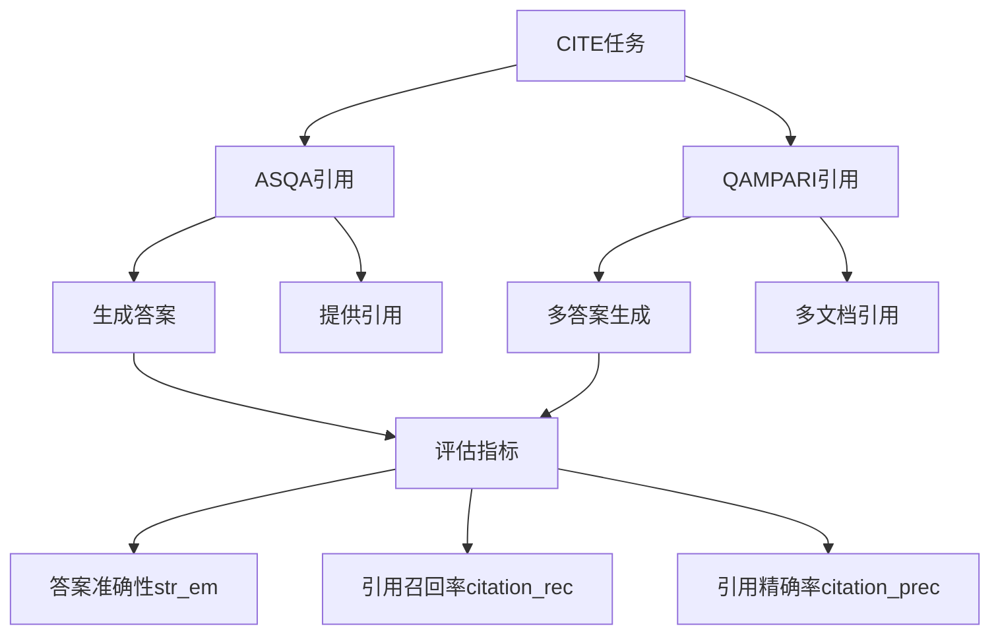

CITE (Citation) 是一个引用生成任务，主要评估模型生成答案时正确引用源文档的能力。让我详细解释：



具体包含两个子任务：

1. ASQA (Answering with Sources QA):
```python
# 示例
Input: "What are the health benefits of green tea?"
Output: """
Green tea has several health benefits:
1. Contains antioxidants [doc1]
2. May boost brain function [doc2]
3. Can help with weight loss [doc1, doc3]
"""
```

2. QAMPARI (Question Answering with Many Answers Requiring Integrated evidence):
```python
# 示例
Input: "What are the major cities in Japan?"
Output: """
Major cities in Japan include:
- Tokyo, the capital and largest city [doc1]
- Osaka, a major economic hub [doc2]
- Kyoto, the cultural capital [doc3]
- Yokohama, a major port city [doc4]
"""
```

评估指标：
```python
metrics = {
    "str_em": 0.75,        # 答案准确率
    "citation_rec": 0.82,  # 引用召回率（找到了多少相关引用）
    "citation_prec": 0.88  # 引用精确率（引用是否准确）
}
```

任务特点：
1. 需要生成答案
2. 需要提供引用来源
3. 评估引用的准确性
4. 支持多文档整合

这个任务的目的是：
1. 评估模型的知识整合能力
2. 测试模型的引用准确性
3. 验证模型的多文档理解能力
4. 确保生成内容的可溯源性