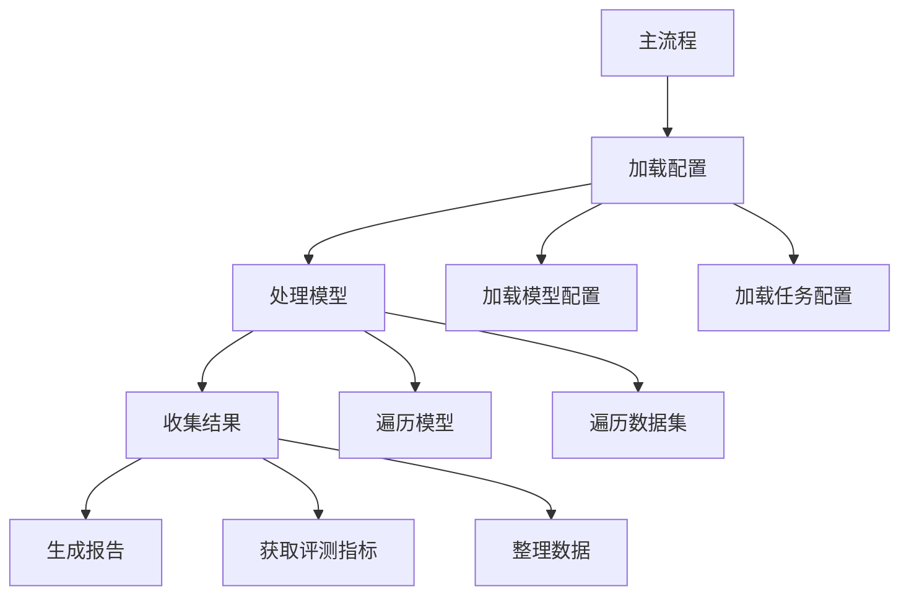

让我详细解析 `collect_results.py` 的 main 方法执行逻辑：



主要步骤解析：

1. 配置加载：
```python
# 1. 模型配置列表
models_configs = [
    # 闭源模型
    {"model": "gpt-4-0125-preview", "use_chat_template": True, ...},
    # llama系列
    {"model": "LLaMA-2-7B-32K", "use_chat_template": False, ...},
    # mistral系列
    {"model": "Mistral-7B-v0.1", "use_chat_template": False, ...},
    # 其他模型...
]

# 2. 任务配置文件
configs = [
    "configs/recall.yaml",
    "configs/rag.yaml",
    "configs/rerank.yaml",
    "configs/cite.yaml",
    "configs/longqa.yaml",
    "configs/summ.yaml",
    "configs/icl.yaml"
]
```

2. 处理配置文件：
```python
datasets_configs = []
for config in configs:
    # 加载yaml配置
    c = yaml.safe_load(open(config))
    
    # 处理生成长度和输入长度配置
    if isinstance(c["generation_max_length"], int):
        c["generation_max_length"] = ",".join([str(c["generation_max_length"])] * len(c["datasets"].split(",")))
    
    # 构建数据集配置
    for d, t, l, g in zip(
        c['datasets'].split(','),
        c['test_files'].split(','),
        c['input_max_length'].split(','),
        c['generation_max_length'].split(',')
    ):
        datasets_configs.append({
            "dataset": d,
            "test_name": os.path.basename(os.path.splitext(t)[0]),
            "input_max_length": int(l),
            "generation_max_length": int(g),
            "use_chat_template": c["use_chat_template"],
            "max_test_samples": c["max_test_samples"],
            'shots': c['shots']
        })
```

3. 收集评测结果：
```python
df = []
for model in tqdm(models_configs):
    # 初始化参数
    args = arguments()
    args.tag = "v1"
    args.output_dir = f"output/{model['model']}"

    # 遍历数据集配置
    for dataset in datasets_configs:
        # 更新参数
        args.update(dataset)
        args.update(model)

        # 获取评测指标
        metric = args.get_averaged_metric()
        dsimple, mnames = args.get_metric_name()

        if metric is None:
            continue
            
        # 收集结果
        for k, m in metric.items():
            df.append({
                **asdict(args), 
                **model,
                "metric name": k, 
                "metric": m,
                "dataset_simple": dsimple + " " + k,
                "test_data": f"{args.dataset}-{args.test_name}-{args.input_max_length}"
            })
```

4. 生成报告：
```python
# 创建数据透视表
all_df = pd.DataFrame(df)
lf_df = all_df.pivot_table(
    index=["model", "input_max_length"],
    columns="dataset_simple",
    values="metric",
    sort=False
)
lf_df = lf_df.reset_index()

# 输出CSV报告
print(lf_df.to_csv(index=False))
```

[[helmet cite]]

[[helmet icl]]

[[helmet cite dataset]]

[[helmet 处理模型]]

[[helmet dataset_to_metrics]]

[[helmet dataset_to_metrics 详细例子]]

[[helmet metrics[] ]]

[[helmet costom_avgs的作用是什么 ]]

[[helmct models_config 的作用是什么 ]]

[[helmet set_confg ]]

[[helmet 收集结果]]

[[helmet 如何获取评测指标]]

[[helmet 收集数据]]
主要功能：
1. 收集多个模型在不同任务上的评测结果
2. 支持多种评测指标
3. 生成结构化的评测报告
4. 便于模型间比较

需要我详细解释某个具体部分吗？