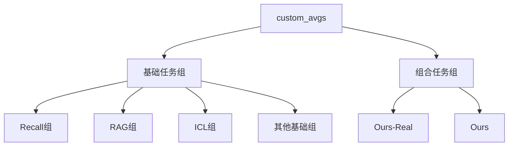

`custom_avgs` 是一个任务分组配置字典，用于将不同的评测任务和指标组织成逻辑组。让我详细解释：



1. 基础任务组示例：
```python
# Recall任务组
"Recall": [
    "json_kv substring_exact_match",          # JSON KV任务的精确匹配
    "ruler_niah_mk_2 ruler_recall",          # NIAH MK2的召回率
    "ruler_niah_mk_3 ruler_recall",          # NIAH MK3的召回率
    "ruler_niah_mv ruler_recall"             # NIAH MV的召回率
]

# RAG任务组
"RAG": [
    'nq substring_exact_match',              # Natural Questions
    'hotpotqa substring_exact_match',        # HotpotQA
    'popqa substring_exact_match',           # PopQA
    'triviaqa substring_exact_match'         # TriviaQA
]
```

2. 组合任务组：
```python
# Ours-Real: 实际任务的组合
"Ours-Real": [
    'RAG',      # RAG任务组
    'ICL',      # ICL任务组
    'Cite',     # 引用任务组
    'Re-rank',  # 重排序任务组
    'LongQA',   # 长文本QA任务组
    'Summ'      # 摘要任务组
]

# Ours: 包含所有任务的组合
"Ours": [
    'Recall',   # 召回任务组
    'RAG',      # RAG任务组
    'ICL',      # ICL任务组
    'Cite',     # 引用任务组
    'Re-rank',  # 重排序任务组
    'LongQA',   # 长文本QA任务组
    'Summ'      # 摘要任务组
]
```

主要作用：
1. 任务分组：将相关任务和指标组织在一起
2. 层次结构：支持基础任务组和组合任务组
3. 评估聚合：便于计算组级别的性能
4. 结果展示：方便展示不同类型任务的结果

使用场景：
```python
# 1. 获取某个组的所有指标
def get_group_metrics(group_name):
    metrics = custom_avgs[group_name]
    if isinstance(metrics[0], str):
        return metrics  # 基础任务组
    else:
        # 展开组合任务组
        return [m for subgroup in metrics 
               for m in custom_avgs[subgroup]]

# 2. 计算组平均性能
def calculate_group_performance(results, group_name):
    metrics = get_group_metrics(group_name)
    scores = [results[m] for m in metrics]
    return np.mean(scores)
```

这种设计的优点：
1. 结构化组织评测指标
2. 支持灵活的任务组合
3. 便于计算和比较不同任务组的性能
4. 方便生成分组报告