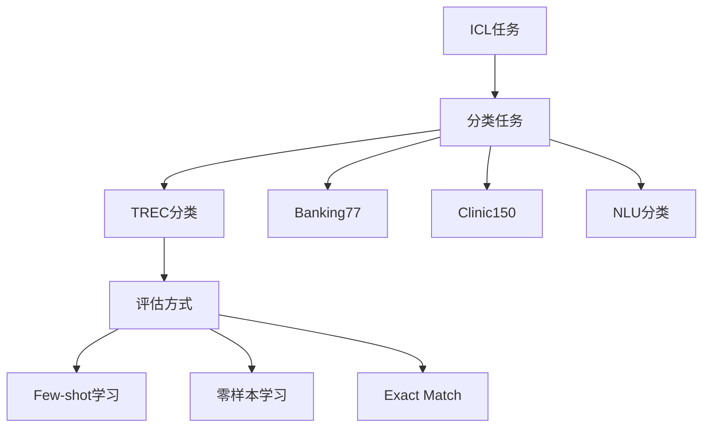

ICL (In-Context Learning) 是上下文学习任务，主要评估模型通过少量示例进行学习的能力。让我详细解释：




在代码中的具体任务：
```python
dataset_to_metrics = {
    # ICL分类任务
    "trec_coarse": "exact_match",  # TREC粗粒度分类
    "trec_fine": "exact_match",    # TREC细粒度分类
    "banking77": "exact_match",    # 银行业务分类
    "clinic150": "exact_match",    # 医疗问题分类
    "nlu": "exact_match"           # 自然语言理解分类
}
```


典型示例：
```python
# 1. TREC分类示例
Input: """
Question: What is the capital of France?
Answer: LOCATION

Question: Who invented the telephone?
Answer: PERSON

Question: What causes earthquakes?
Answer: DESCRIPTION

Question: What is photosynthesis?
Answer: [待预测]
"""
Expected: "DESCRIPTION"

# 2. Banking77示例
Input: """
Question: How do I activate my new card?
Answer: card_activation

Question: When will my card expire?
Answer: card_expiry

Question: How do I change my PIN?
Answer: [待预测]
"""
Expected: "pin_change"
```


主要特点：
1. Few-shot学习：
```python
def build_prompt(demos, test_item):
    prompt = ""
    # 添加少量示例
    for demo in demos:
        prompt += f"Question: {demo['question']}\n"
        prompt += f"Answer: {demo['answer']}\n\n"
    
    # 添加测试问题
    prompt += f"Question: {test_item['question']}\n"
    prompt += "Answer:"
    return prompt
```


2. 评估方式：
```python
def evaluate_icl(prediction, reference):
    # 精确匹配评估
    metrics = {
        "exact_match": int(prediction.strip() == reference.strip())
    }
    return metrics
```


ICL任务的目的：
1. 测试模型的快速学习能力
2. 评估模型的模式识别能力
3. 验证模型的泛化能力
4. 检验少样本学习效果

应用场景：
```python
# 1. 文本分类
demos = [
    {"text": "我很喜欢这个产品", "label": "正面"},
    {"text": "质量太差了", "label": "负面"}
]

# 2. 意图识别
demos = [
    {"query": "怎么修改密码", "intent": "密码修改"},
    {"query": "账户余额查询", "intent": "余额查询"}
]

# 3. 实体分类
demos = [
    {"entity": "北京", "type": "城市"},
    {"entity": "马云", "type": "人名"}
]
```


评测重点：
1. 分类准确性
2. 示例学习效果
3. 任务理解能力
4. 泛化表现

需要我详细解释某个具体部分吗？