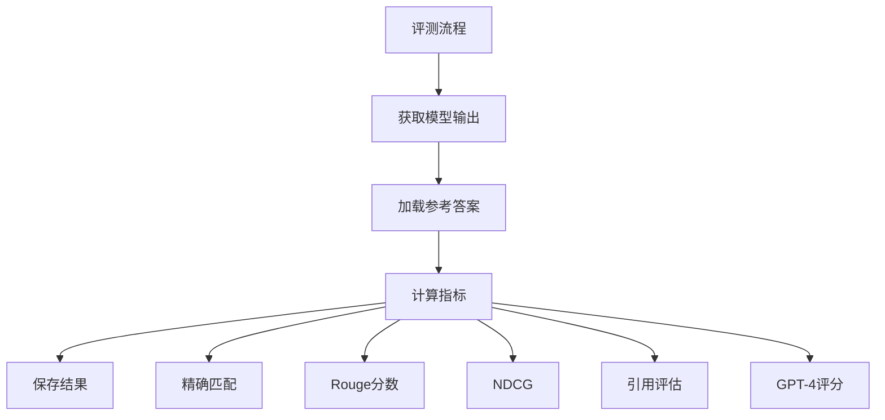

评测指标的获取是通过 `dataset_to_metrics` 字典来定义的，然后在评测过程中计算。让我详细解释：

1. 指标定义：
```python
dataset_to_metrics = {
    # 1. 精确匹配类任务
    "json_kv": "substring_exact_match",
    "nq": "substring_exact_match",
    "popqa": "substring_exact_match",
    
    # 2. GPT-4评分任务
    "narrativeqa": ["gpt-4-score"],
    
    # 3. 重排序任务
    "msmarco_rerank_psg": "NDCG@10",
    
    # 4. 引用任务
    "alce_asqa": [
        "str_em",           # 字符串精确匹配
        "citation_rec",     # 引用召回率
        "citation_prec"     # 引用精确率
    ],
    
    # 5. 摘要任务
    "qmsum": "rougeL_recall",
    "multi_lexsum": ["gpt4-f1"]
}
```

2. 不同类型指标的计算方式：

```python
# 1. 精确匹配计算
def compute_exact_match(prediction, reference):
    return int(prediction.strip() == reference.strip())

# 2. Rouge分数计算
def compute_rouge_scores(prediction, reference):
    scorer = rouge_scorer.RougeScorer(['rouge1', 'rouge2', 'rougeL'])
    scores = scorer.score(reference, prediction)
    return {
        "rouge1": scores['rouge1'].fmeasure,
        "rouge2": scores['rouge2'].fmeasure,
        "rougeL": scores['rougeL'].fmeasure
    }

# 3. NDCG计算
def compute_ndcg(predictions, references, k=10):
    return ndcg_score(references, predictions, k=k)

# 4. 引用评估
def evaluate_citations(prediction, reference_citations):
    cited = extract_citations(prediction)
    recall = len(cited.intersection(reference_citations)) / len(reference_citations)
    precision = len(cited.intersection(reference_citations)) / len(cited)
    return {
        "citation_rec": recall,
        "citation_prec": precision
    }
```

3. 评测流程：


4. 具体实现示例：
```python
def evaluate(prediction, reference, dataset_name):
    # 1. 获取该数据集需要的指标
    metrics = dataset_to_metrics[dataset_name]
    results = {}
    
    # 2. 计算各项指标
    if "substring_exact_match" in metrics:
        results["exact_match"] = compute_exact_match(prediction, reference)
        
    if "rougeL_recall" in metrics:
        rouge_scores = compute_rouge_scores(prediction, reference)
        results["rougeL_recall"] = rouge_scores["rougeL"]
        
    if "NDCG@10" in metrics:
        results["NDCG@10"] = compute_ndcg(prediction, reference)
        
    if "citation_rec" in metrics:
        citation_scores = evaluate_citations(prediction, reference)
        results.update(citation_scores)
        
    if "gpt-4-score" in metrics:
        results["gpt-4-score"] = get_gpt4_evaluation(prediction, reference)
        
    return results
```

5. 结果保存格式：
```json
{
    "averaged_metrics": {
        "exact_match": 0.85,
        "rouge_score": 0.76,
        "citation_rec": 0.82,
        "citation_prec": 0.88
    },
    "individual_results": [
        {
            "input": "问题或输入文本",
            "prediction": "模型输出",
            "reference": "参考答案",
            "metrics": {
                "exact_match": 1,
                "rouge_score": 0.8
            }
        }
    ]
}
```

这个评测系统的特点：
1. 支持多种评估指标
2. 可以针对不同任务使用不同指标
3. 包含自动评估和人工评估(GPT-4)
4. 结果保存格式统一

需要我详细解释某个具体部分吗？