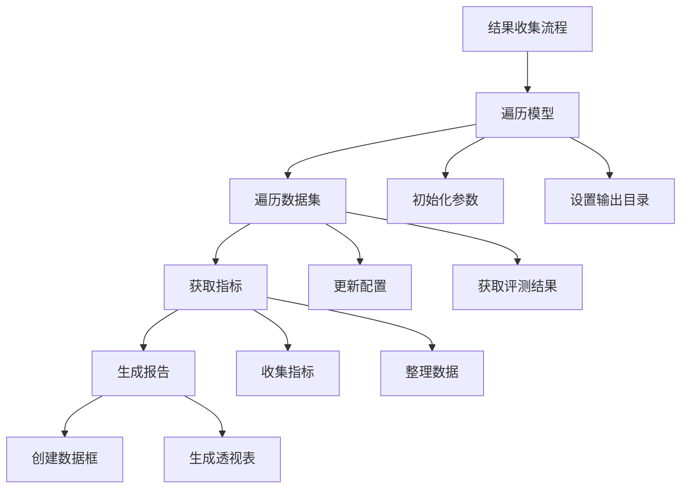

这段代码是结果收集和处理的核心部分，让我详细解释：



1. 遍历模型和数据集：
```python
# 遍历每个模型
for model in tqdm(models_configs):
    # 初始化参数
    args = arguments()
    args.tag = "v1"  # 设置版本标签
    args.output_dir = f"output/{model['model']}"  # 设置输出目录
    
    # 遍历每个数据集
    for dataset in datasets_configs:
        # 更新参数配置
        args.update(dataset)  # 更新数据集配置
        args.update(model)    # 更新模型配置
```

2. 获取评测指标：
```python
# 获取评测结果
metric = args.get_averaged_metric()  # 获取平均指标
dsimple, mnames = args.get_metric_name()  # 获取数据集和指标名称

# 跳过没有结果的情况
if metric is None:
    continue
```

3. 收集结果：
```python
# 遍历每个指标
for k, m in metric.items():
    # 添加到结果列表
    df.append({
        **asdict(args),  # 所有参数配置
        **model,         # 模型配置
        "metric name": k,  # 指标名称
        "metric": m,      # 指标值
        "dataset_simple": dsimple + " " + k,  # 简化的数据集名称
        "test_data": f"{args.dataset}-{args.test_name}-{args.input_max_length}"  # 测试数据信息
    })
```

4. 生成报告：
```python
# 创建数据框
all_df = pd.DataFrame(df)

# 创建透视表
lf_df = all_df.pivot_table(
    index=["model", "input_max_length"],  # 行索引
    columns="dataset_simple",             # 列索引
    values="metric",                      # 值
    sort=False
)

# 重置索引
lf_df = lf_df.reset_index()
```

5. 结果示例：
```python
# 原始数据示例
df = [
    {
        "model": "LLaMA-2-7B",
        "input_max_length": 32768,
        "metric name": "exact_match",
        "metric": 0.85,
        "dataset_simple": "nq exact_match",
        "test_data": "nq-test-32768"
    },
    # ... 更多结果
]

# 透视表示例
"""
model           input_max_length  nq_exact_match  hotpotqa_exact_match
LLaMA-2-7B      32768            0.85           0.82
LLaMA-2-7B      65536            0.87           0.84
Mistral-7B      32768            0.88           0.86
"""
```

主要功能：
1. 遍历所有模型和数据集组合
2. 收集评测指标
3. 整理结果数据
4. 生成结构化报告

这样的设计允许：
1. 批量处理评测结果
2. 标准化结果格式
3. 便于比较分析
4. 生成清晰的报告

需要我详细解释某个具体部分吗？