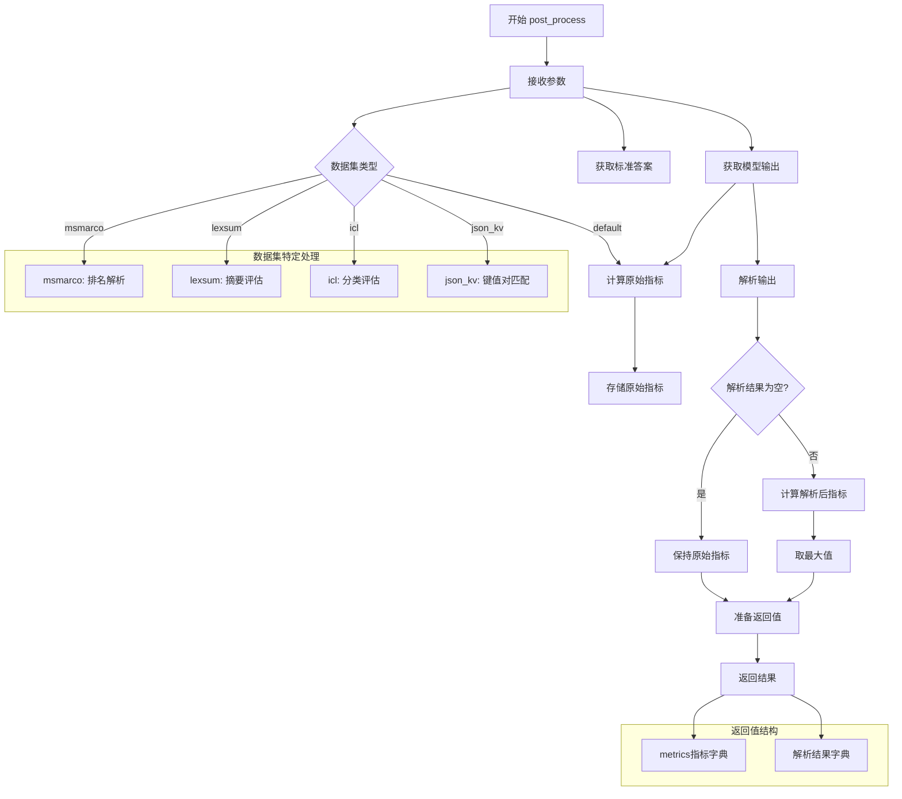

主要处理步骤：

1. 输入处理：

	- 获取模型输出 (output["output"])
	
	- 获取标准答案 (example["answer"])

2. 指标计算：

	- 计算原始指标
	
	- 尝试解析输出
	
	- 计算解析后指标（如果可能）
	
	- 取两组指标的最大值

3.  特定数据集处理：

	- msmarco: 文档排序评估
	
	- lexsum: 摘要生成评估
	
	- icl: 分类任务评估
	
	- json_kv: 键值对提取评估

4.  返回两个字典：
	
	- metrics: 包含评估指标
	
	- others: 包含解析结果

