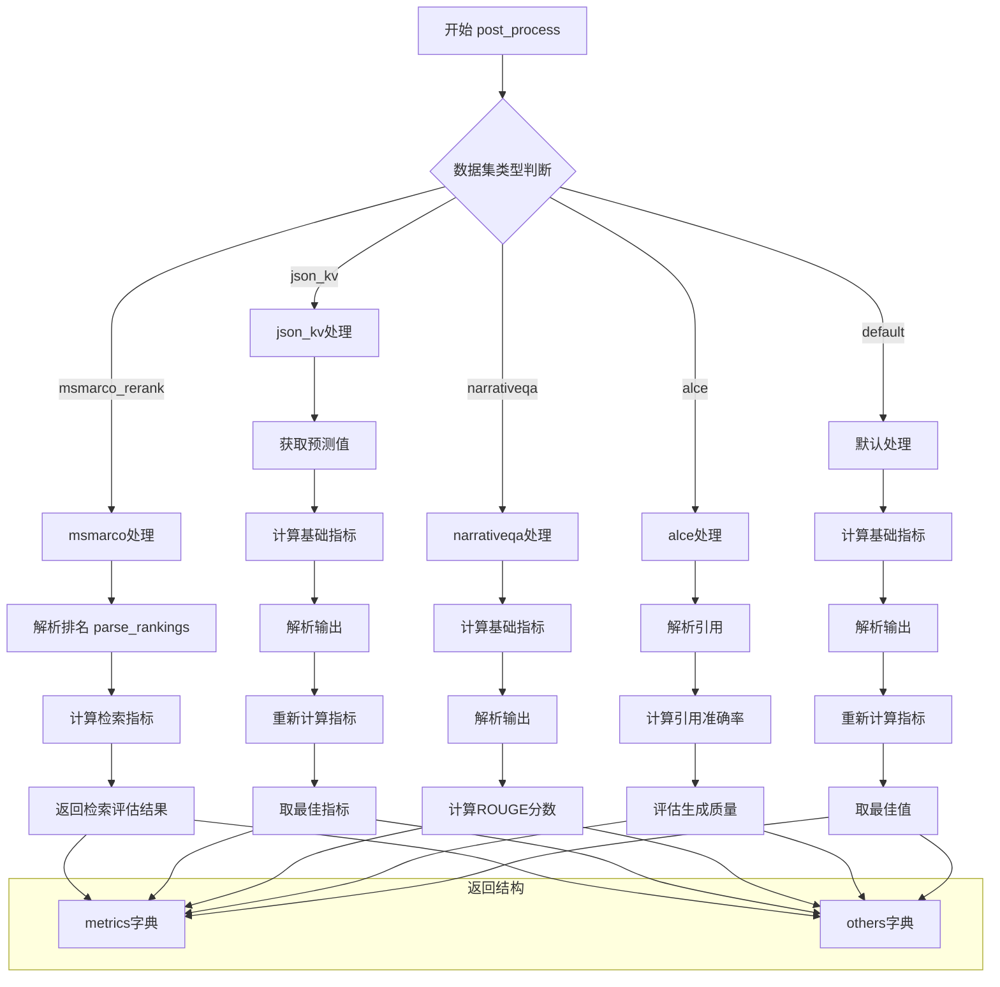

主要处理逻辑：

1. msmarco_rerank:
```python
def post_process(output, example):
    parsed_pred = parse_rankings(output["output"])
    mets = calculate_retrieval_metrics(
        {example['qid']: parsed_pred}, 
        qrels, 
        k_values
    )
    return mets, {"parsed_output": parsed_pred}
```

2. json_kv:
```python
def post_process(output, example):
    prediction = output["output"]
    answer = example["answer"]
    mets = calculate_metrics(prediction, answer)
    parsed_pred = parse_output(prediction, "corresponding value:")
    new_mets = calculate_metrics(parsed_pred, answer)
    mets = {k: max(v, new_mets[k]) for k, v in mets.items()}
    return mets, {"parsed_output": parsed_pred}
```

3. default:
```python
def default_post_process(output, example):
    prediction = output["output"]
    answer = example["answer"]
    mets = calculate_metrics(prediction, answer)
    parsed_pred = parse_output(prediction)
    if parsed_pred is not None:
        new_mets = calculate_metrics(parsed_pred, answer)
        mets = {k: max(v, new_mets[k]) for k, v in mets.items()}
    return mets, {"parsed_output": parsed_pred}
```

每种数据集类型的特点：
1. msmarco: 关注文档排序和检索性能
2. json_kv: 关注键值对提取的准确性
3. narrativeqa: 关注生成答案的质量
4. alce: 关注引用准确性和生成质量
5. default: 通用的评估方式

需要我详细解释某个特定数据集的处理流程吗？