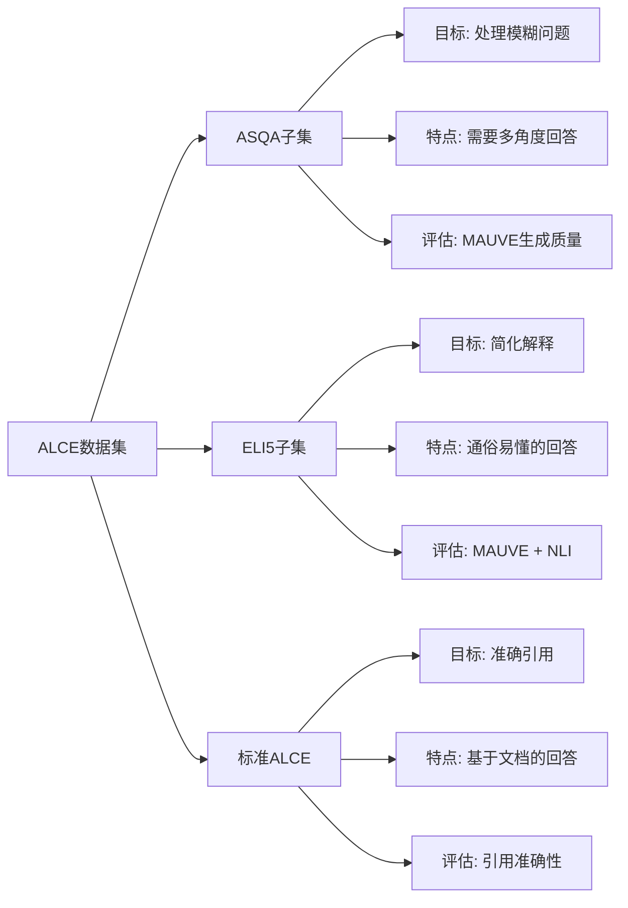
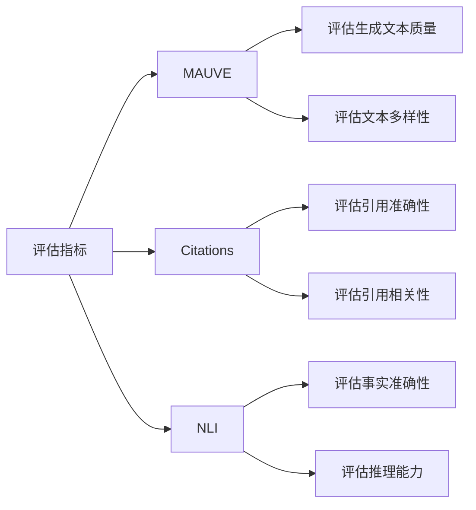
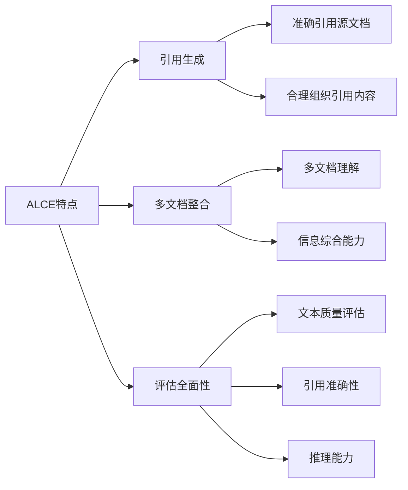

ALCE (Active Learning through Conversational Exchanges) 是一个专注于对话式学习和引用生成的数据集系列。让我详细介绍：

1. ALCE 的主要组成：


2. 评估指标说明：


3. 数据格式示例：
```python
# ALCE数据样例
{
    "query": "请解释量子纠缠的概念",
    "ctxs": [
        {
            "id": "doc1",
            "text": "量子纠缠是量子力学中的...",
            "title": "量子力学基础",
            "label": 1  # 相关性标签
        },
        # ... 更多文档
    ],
    "answer": "根据[doc1]，量子纠缠是..."
}
```

4. 主要特点：



5. 使用场景：
- 学术问答：需要准确引用的场景
- 教育解释：ELI5子集适用于教育场景
- 多角度分析：ASQA子集适用于复杂问题分析

6. 代码中的处理：
```python
# 不同子集的评估处理
if "alce" in dataset:
    # 基础评估设置
    cli_args = ["--f", output_path]
    
    # 引用评估
    if not "nocite" in dataset:
        cli_args.append("--citations")
    
    # ASQA特殊处理
    if "asqa" in dataset:
        cli_args.append("--mauve")
    
    # ELI5特殊处理
    elif "eli5" in dataset:
        cli_args += ["mauve", "--claims_nli"]
```

7. 评估重点：
- 文本生成质量（MAUVE评分）
- 引用准确性（Citations检查）
- 解释准确性（NLI验证）
- 回答完整性
- 信息整合能力

8. 应用价值：
- 提升模型的文档引用能力
- 改进多文档理解能力
- 增强解释生成能力
- 提高回答的可信度

ALCE数据集的设计反映了现代AI系统在实际应用中的重要需求：
1. 准确性：通过引用支持回答
2. 可解释性：清晰的解释和引用
3. 多样性：处理不同类型的问题
4. 可验证性：通过多重指标评估

需要我详细解释某个具体方面吗？