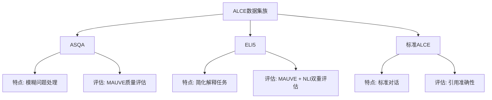
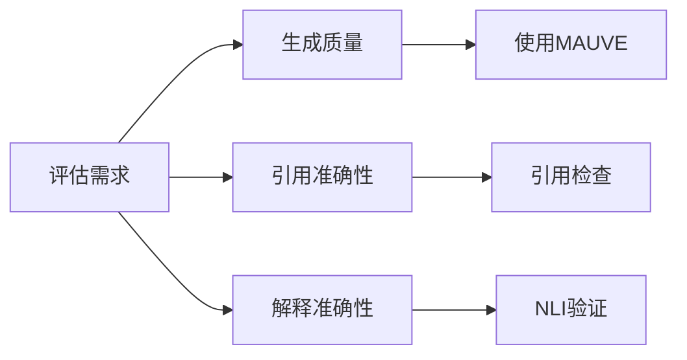
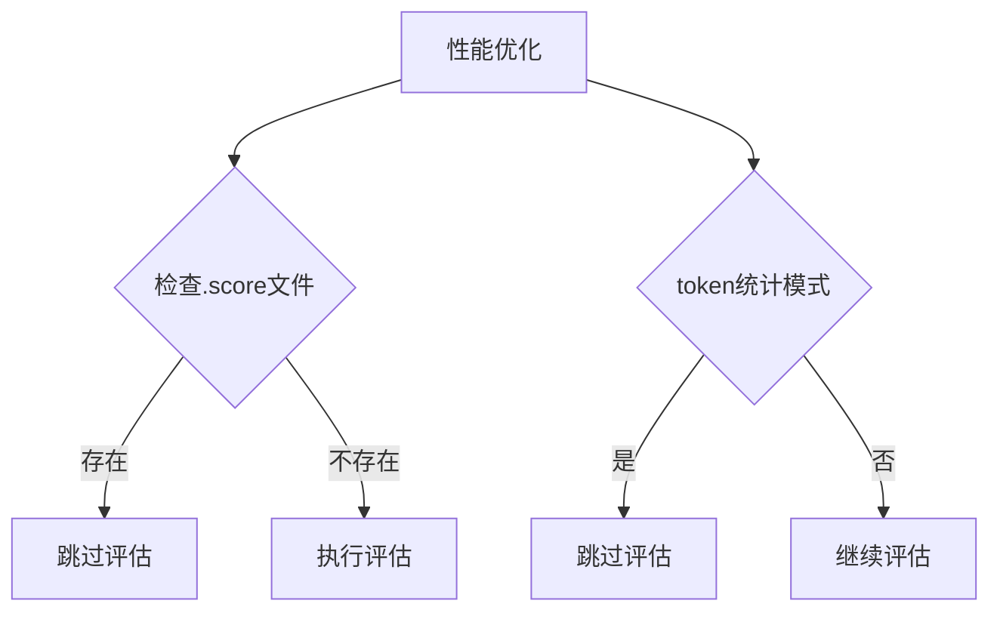

这样设计的原因主要有以下几点：

1. 数据集特性不同：


2. 评估需求不同：


3. 性能优化考虑：


设计优势：

1. 模块化：
```python
# 可以灵活添加新的评估模块
if "new_dataset" in dataset:
    cli_args += ["new_metric"]
```

2. 避免重复工作：
```python
# 检查是否需要重新评估
if not os.path.exists(output_path+".score") or args.overwrite:
    # 执行评估
```

3. 针对性评估：
```python
# 不同数据集使用不同评估指标
if "asqa" in dataset:
    cli_args.append("--mauve")
elif "eli5" in dataset:
    cli_args += ["mauve", "--claims_nli"]
```

4. 资源效率：
```python
# 只在必要时进行评估
if not args.count_tokens:  # 如果不是统计模式
    # 执行评估
```

这种设计的实际意义：
1. 提高评估准确性：针对不同类型的任务使用最合适的评估指标
2. 提高效率：避免不必要的重复评估
3. 灵活性：容易扩展新的数据集和评估指标
4. 可维护性：模块化设计便于维护和更新

总的来说，这种设计反映了软件工程中的几个重要原则：
- 单一职责原则：每个评估模块专注于特定类型的评估
- 开放封闭原则：易于扩展新的评估方式
- DRY原则：避免重复工作
- 效率优先：优化资源使用