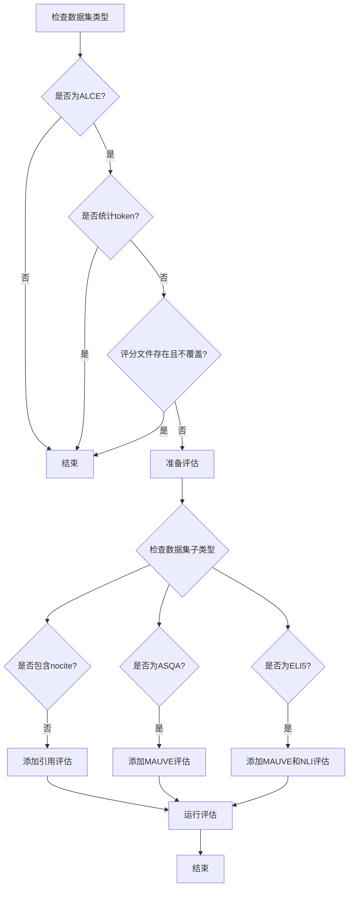

这段代码是针对 ALCE (Active Learning through Conversational Exchanges) 数据集的特殊评估处理。让我详细解释：

```python
# 条件判断
if ("alce" in dataset                     # 是ALCE数据集
    and not args.count_tokens             # 不是在统计token
    and (not os.path.exists(output_path+".score") # 评分文件不存在
         or args.overwrite)):             # 或需要覆盖
```

评估参数设置：
```python
# 基础参数
cli_args = ["--f", output_path]  # 指定输出文件路径

# 引用评估
if not "nocite" in dataset:      # 如果不是nocite版本
    cli_args.append("--citations")  # 添加引用评估

# 特定子数据集的额外评估
if "asqa" in dataset:            # ASQA子数据集
    cli_args.append("--mauve")   # 添加MAUVE评估
elif "eli5" in dataset:          # ELI5子数据集
    cli_args += ["mauve", "--claims_nli"]  # 添加MAUVE和NLI评估
```

ALCE 数据集的不同变体：
1. `asqa` (Ambiguous Questions):
   - 处理模糊问题
   - 使用 MAUVE 评估生成质量

2. `eli5` (Explain Like I'm 5):
   - 简化解释任务
   - 使用 MAUVE 评估生成质量
   - 使用 NLI 评估解释的准确性

3. 标准 ALCE:
   - 评估引用的准确性
   - 检查生成内容的质量

评估指标说明：
- `MAUVE`: 评估生成文本的质量和多样性
- `citations`: 评估引用的准确性
- `claims_nli`: 评估生成内容的事实准确性

使用流程图表示：



这种评估设计的优点：
1. 针对不同子数据集使用合适的评估指标
2. 可以灵活配置评估选项
3. 避免重复评估（通过检查.score文件）
4. 支持强制重新评估（通过overwrite参数）