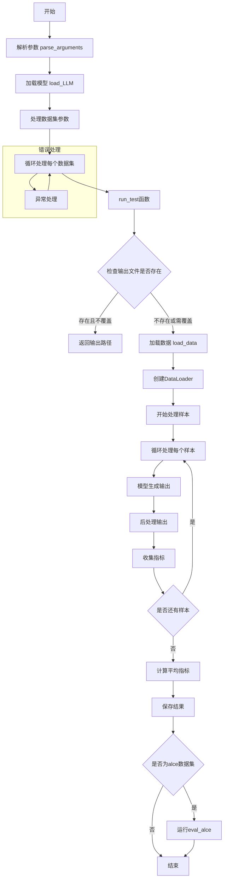

主要流程说明：

1. 初始化阶段：

	- 记录日志
	
	- 构建输出路径
	
	- 检查文件是否存在

2.  数据准备：

	- 设置随机种子
	
	- 加载数据
	
	- 创建 DataLoader

3. 主处理循环：
	
	- 对每个样本进行处理
	
	- 生成模型输出
	
	- 后处理和指标收集
	
	- 可选的示例打印

4. 结果处理：

	- 计算性能指标（内存使用、处理速度）
	
	- 计算平均指标
	
	- 保存结果

5.  特殊功能：
	
	- token 统计模式
	
	- 示例打印控制
	
	- 性能监控

这个流程图展示了 run_test 函数的详细执行过程，包括所有主要的条件分支和数据流向。需要对某个部分进行更详细的说明吗？