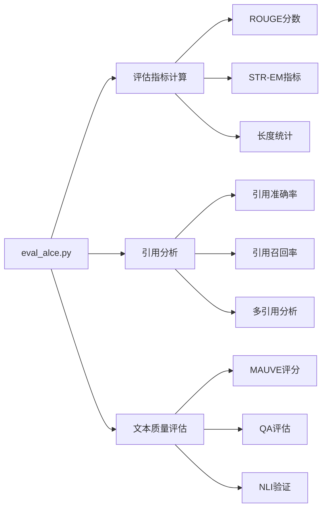
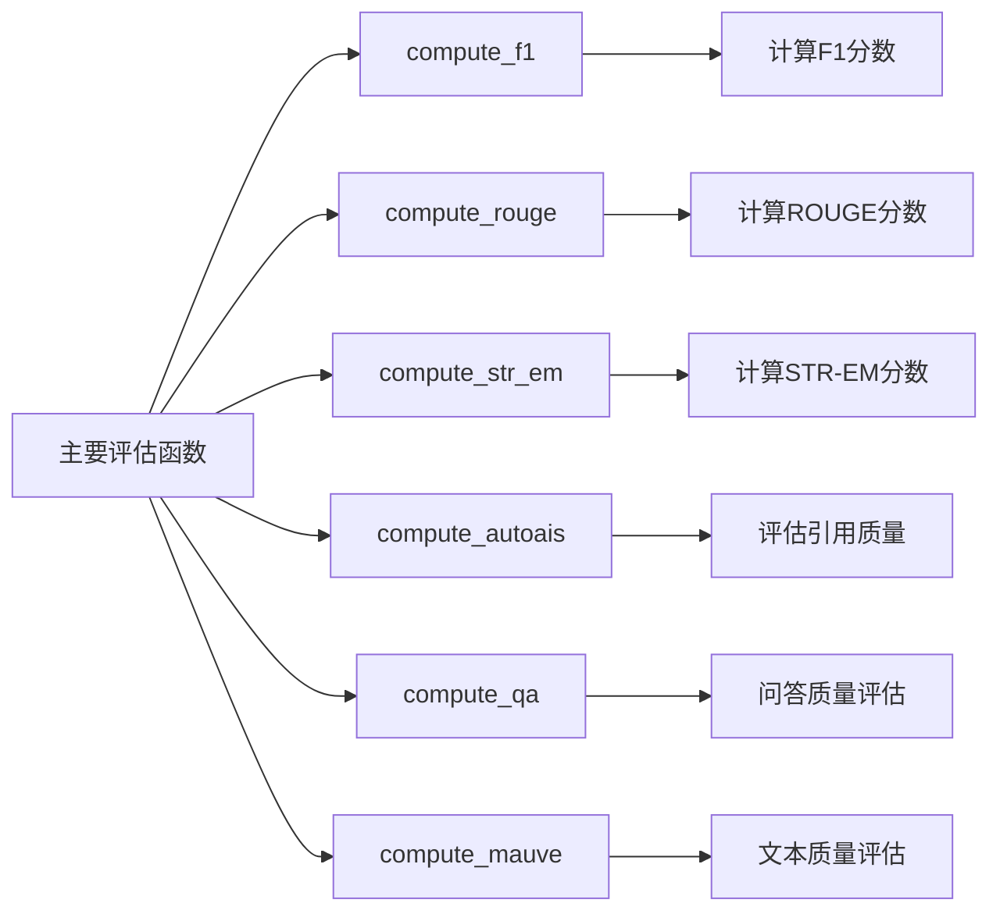
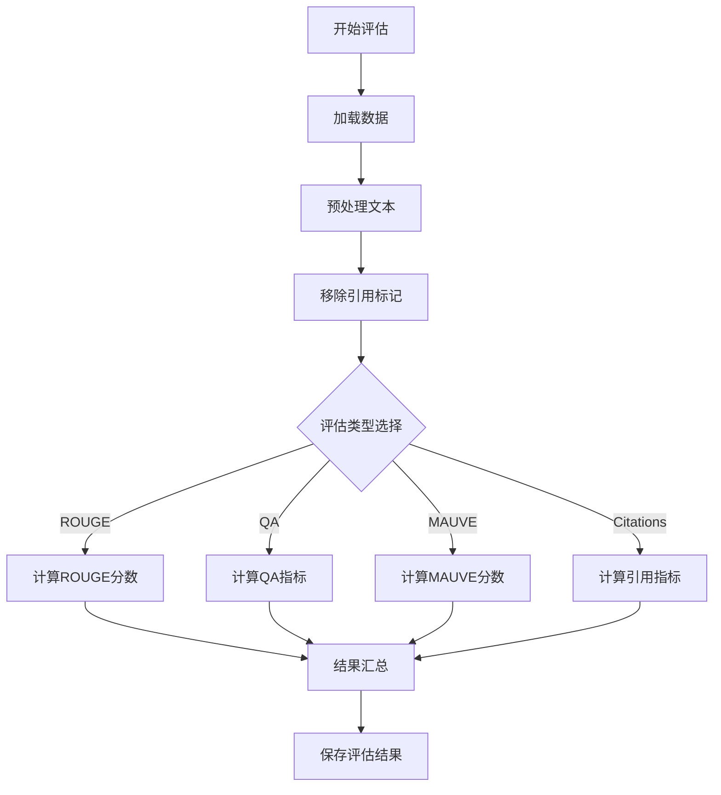

让我详细解释 `eval_alce.py` 的功能和结构：

1. 主要功能：


2. 核心评估函数：


3. 关键函数说明：

```python
# 计算F1分数
def compute_f1(a_gold, a_pred):
    # 评估预测答案与标准答案的匹配度
    # 返回F1分数（0-1之间）

# 计算STR-EM (String Exact Match)
def compute_str_em(data):
    # 评估答案的精确匹配程度
    # 返回精确匹配率和命中率

# 计算AutoAIS (自动引用评分)
def compute_autoais(data, ...):
    # 评估引用的准确性和完整性
    # 返回引用召回率和精确率
```

4. 评估流程：


5. 主要参数说明：
```python
parser.add_argument("--f", type=str, required=True)  # 输入文件
parser.add_argument("--no_rouge", action="store_true")  # 是否跳过ROUGE评估
parser.add_argument("--qa", action="store_true")  # 是否进行QA评估
parser.add_argument("--mauve", action="store_true")  # 是否计算MAUVE分数
parser.add_argument("--citations", action="store_true")  # 是否评估引用
```

6. 评估指标说明：
- ROUGE：评估生成文本与参考文本的重叠度
- STR-EM：评估精确匹配程度
- AutoAIS：评估引用的质量
- MAUVE：评估生成文本的整体质量
- QA：评估问答准确性

7. 特殊处理：
```python
# 文本预处理
data[i]['output'] = re.sub(r"\n+", " ", data[i]['output'])
data[i]['output'] = data[i]['output'].replace("<|im_end|>", "")

# 引用处理
normalized_data[i]['output'] = remove_citations(normalized_data[i]['output'])
```

8. 输出结果：
```python
result = {
    'length': 平均长度,
    'str_em': 精确匹配率,
    'str_hit': 命中率,
    'rougeLsum': ROUGE分数,
    'mauve': MAUVE分数,
    'citation_rec': 引用召回率,
    'citation_prec': 引用精确率
}
```

这个评估系统的设计体现了：
1. 全面性：多角度评估生成文本
2. 灵活性：可选择不同评估指标
3. 可扩展性：易于添加新的评估指标
4. 实用性：提供详细的评估报告

需要我详细解释某个具体部分吗？