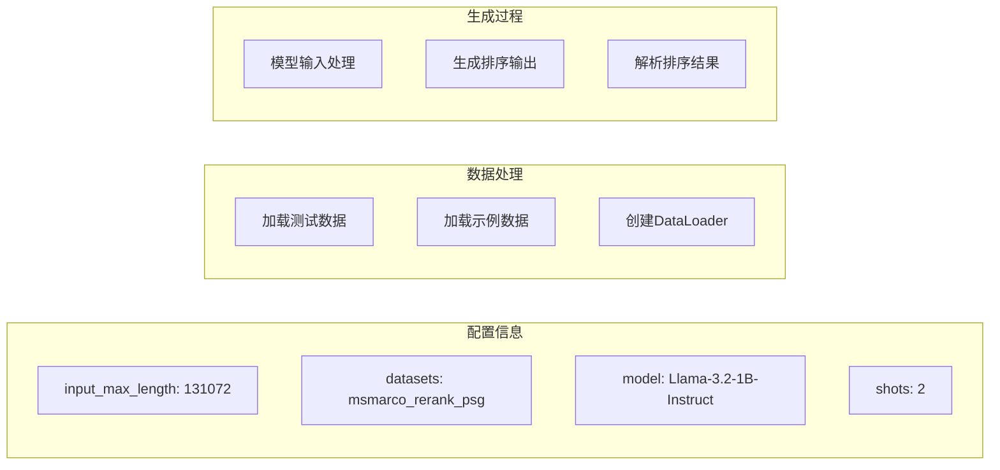
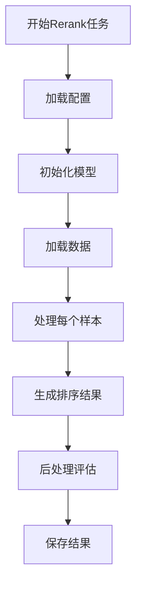

让我详细解释运行 rerank 任务的流程：






详细步骤说明：

1. 配置加载：
```python
# 从rerank.yaml加载配置
input_max_length = 131072
datasets = "msmarco_rerank_psg"
model_name = "meta-llama/Llama-3.2-1B-Instruct"
shots = 2
```


2. 数据处理：
```python
# 加载数据
data = load_data(args, dataset, test_file, demo_file)
# test_file: data/msmarco/test_reranking_data_k1000_dep3.jsonl
# demo_file: data/msmarco/test_reranking_data_k10_dep3.jsonl

dataloader = DataLoader(
    TestItemDataset(data, model, model.tokenizer),
    batch_size=1,
    shuffle=False
)
```


3. 生成过程：
```python
for idx, inputs in enumerate(tqdm(dataloader)):
    # 获取测试样本
    test_item = data["data"][idx]
    inputs, input_text = inputs[0]
    
    # 生成排序结果
    output = model.generate(inputs=inputs)
    
    # 后处理
    if not args.use_chat_template:
        prepend_text = data["system_template"].format(**test_item)
        output["output"] = prepend_text + output["output"]
```


4. 评估和保存：
```python
# 计算指标
mets, others = data['post_process'](output, test_item)

# 保存结果
output_path = os.path.join(
    args.output_dir,
    f"msmarco_rerank_psg_{tag}_{test_name}_in131072_size100_shots2..."
)
```


特殊处理：
1. 大上下文处理：
```python
input_max_length = 131072  # 支持长文本输入
```


2. Few-shot设置：
```python
shots = 2  # 使用2个示例进行few-shot学习
```


3. 输出格式：
```python
use_chat_template = False  # 不使用chat模板
stop_new_line = True      # 在换行符处停止生成
```


4. 性能监控：
```python
# 记录内存使用
mem_usage = sum([torch.cuda.max_memory_allocated(i) 
                for i in range(torch.cuda.device_count())])

# 记录处理速度
throughput = len(results) / (end_time - start_time)
```


rerank任务的特点：
1. 大规模文本处理：支持131K的输入长度
2. 排序任务：对文档进行相关性排序
3. Few-shot学习：使用少量示例指导模型
4. 效率优化：批处理和内存管理

输出文件包含：
1. 原始结果
2. 评估指标
3. 性能统计
4. 配置信息

需要我详细解释某个具体部分吗？