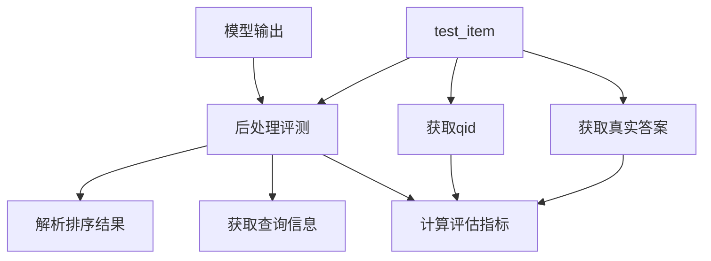

在模型推理完成后的评测过程中，test_data 主要在后处理 (post_process) 阶段使用。让我详细解释：

```python
# 推理完成后的评测流程
def post_process(output, test_item):  # test_item 就是来自 test_data 的单个样本
    # 1. 解析模型输出得到排序结果
    parsed_pred = parse_rankings(output["output"])
    
    # 2. 使用 test_item 获取评测所需信息
    qid = test_item['qid']  # 获取查询ID
    
    # 3. 计算评估指标
    metrics = calculate_retrieval_metrics(
        {qid: parsed_pred},  # 预测的排序
        qrels,               # 真实相关性标注
        k_values=[1, 3, 5, 10]
    )
    
    return metrics, {"parsed_output": parsed_pred}
```



具体使用 test_item 的场景：

1. 获取查询ID (qid)：
```python
qid = test_item['qid']  # 用于关联评测结果
```

2. 获取真实答案（如果需要）：
```python
if 'answer' in test_item:
    ground_truth = test_item['answer']
```

3. 结果分析（可选）：
```python
# 分析排序结果
if 'candidates' in test_item:
    original_docs = test_item['candidates']
    analysis = analyze_ranking_quality(parsed_pred, original_docs)
```

这就是为什么在 `run_test` 函数中，我们会看到：
```python
mets, others = data['post_process'](output, test_item)  # 传入 test_item
```

主要用途是提供评测所需的元信息（如qid），而不是用于构建输入或生成。