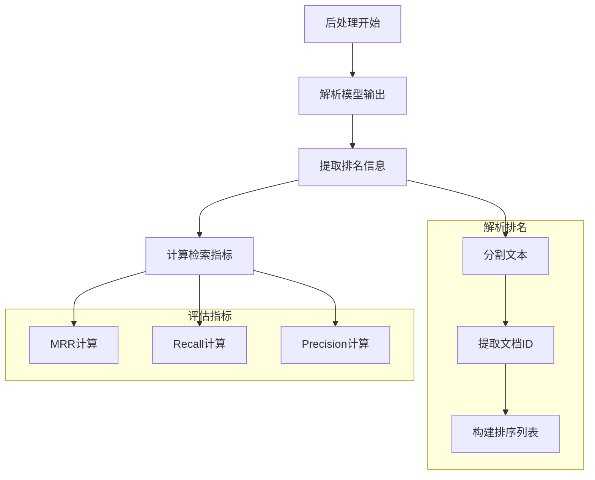

`post_process` 主要处理排序结果：



核心代码流程：

1. 排名解析：
```python
def parse_rankings(text):
    """解析模型输出的排名信息"""
    try:
        # 提取排名列表
        rankings = []
        for line in text.split('\n'):
            if line.strip():
                # 提取文档ID
                doc_id = extract_doc_id(line)
                if doc_id:
                    rankings.append(doc_id)
        return rankings
    except:
        return []
```

2. 后处理函数：
```python
def post_process(output, example):
    # 解析预测的排名
    parsed_pred = parse_rankings(output["output"])
    
    # 计算检索评估指标
    mets = calculate_retrieval_metrics(
        {example['qid']: parsed_pred},  # 预测的排名
        qrels,                          # 真实相关性标注
        k_values                        # 评估的K值列表
    )
    
    return mets, {"parsed_output": parsed_pred}
```

3. 评估指标计算：
```python
def calculate_retrieval_metrics(rankings, qrels, k_values):
    metrics = {}
    
    # 计算MRR (Mean Reciprocal Rank)
    metrics['mrr'] = calculate_mrr(rankings, qrels)
    
    # 计算不同K值的召回率
    for k in k_values:
        metrics[f'recall@{k}'] = calculate_recall_at_k(
            rankings, qrels, k
        )
        
    # 计算不同K值的精确率
    for k in k_values:
        metrics[f'precision@{k}'] = calculate_precision_at_k(
            rankings, qrels, k
        )
    
    return metrics
```

4. 具体指标说明：

```python
# MRR (Mean Reciprocal Rank)
def calculate_mrr(rankings, qrels):
    """计算第一个相关文档的倒数排名的平均值"""
    
# Recall@K
def calculate_recall_at_k(rankings, qrels, k):
    """计算前K个文档中相关文档的召回率"""
    
# Precision@K
def calculate_precision_at_k(rankings, qrels, k):
    """计算前K个文档中相关文档的精确率"""
```

5. 输出示例：
```python
{
    "metrics": {
        "mrr": 0.85,
        "recall@1": 0.75,
        "recall@5": 0.90,
        "precision@1": 0.80,
        "precision@5": 0.60
    },
    "parsed_output": [
        "doc_1",
        "doc_5",
        "doc_3",
        ...
    ]
}
```

