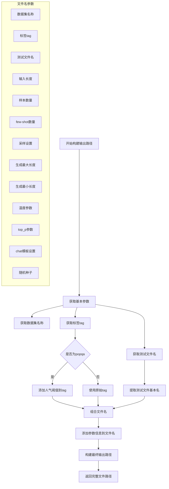

文件名构建过程：

1. 基础部分：
```python
test_name = os.path.splitext(os.path.basename(test_file))[0]
```

2. 特殊处理：
```python
if dataset == "popqa":
    tag += f"_pop{args.popularity_threshold}"
```

3. 完整文件名格式：
```python
output_path = os.path.join(
    args.output_dir,
    f"{dataset}_"                     # 数据集
    f"{tag}_"                         # 标签
    f"{test_name}_"                   # 测试文件
    f"in{args.input_max_length}_"     # 输入长度
    f"size{args.max_test_samples}_"   # 样本数
    f"shots{args.shots}_"             # few-shot数
    f"samp{args.do_sample}"           # 采样
    f"max{args.generation_max_length}"# 最大长度
    f"min{args.generation_min_length}"# 最小长度
    f"t{args.temperature}"            # 温度
    f"p{args.top_p}_"                # top_p
    f"chat{args.use_chat_template}_"  # chat模板
    f"{args.seed}.json"               # 随机种子
)
```

这种命名方式的优点：
1. 包含所有重要参数信息
2. 便于实验追踪和复现
3. 避免文件覆盖
4. 方便结果分析和比较