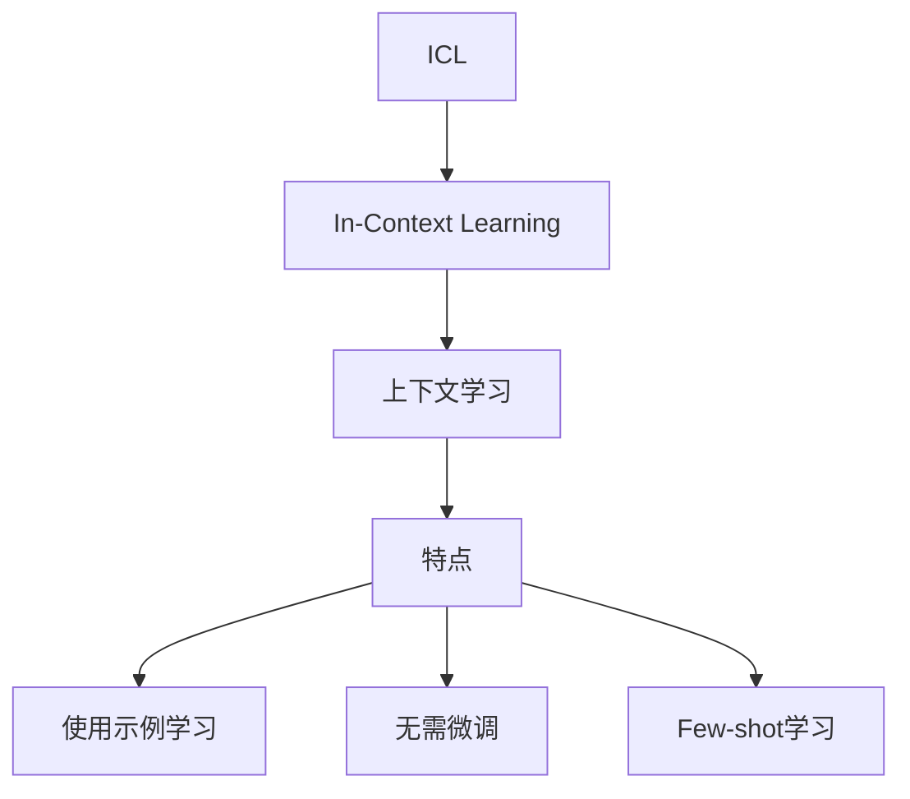
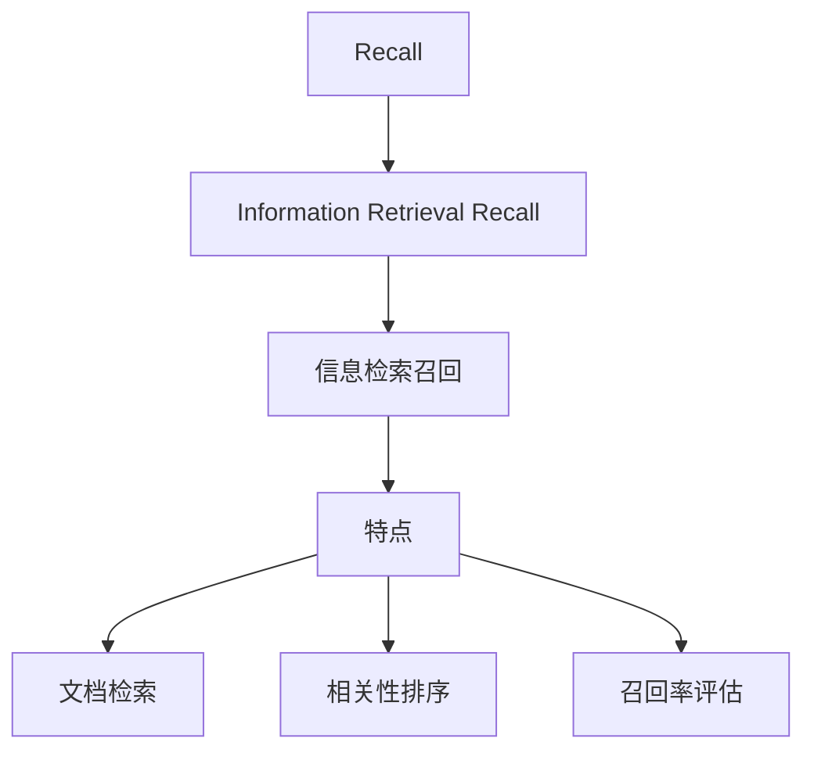
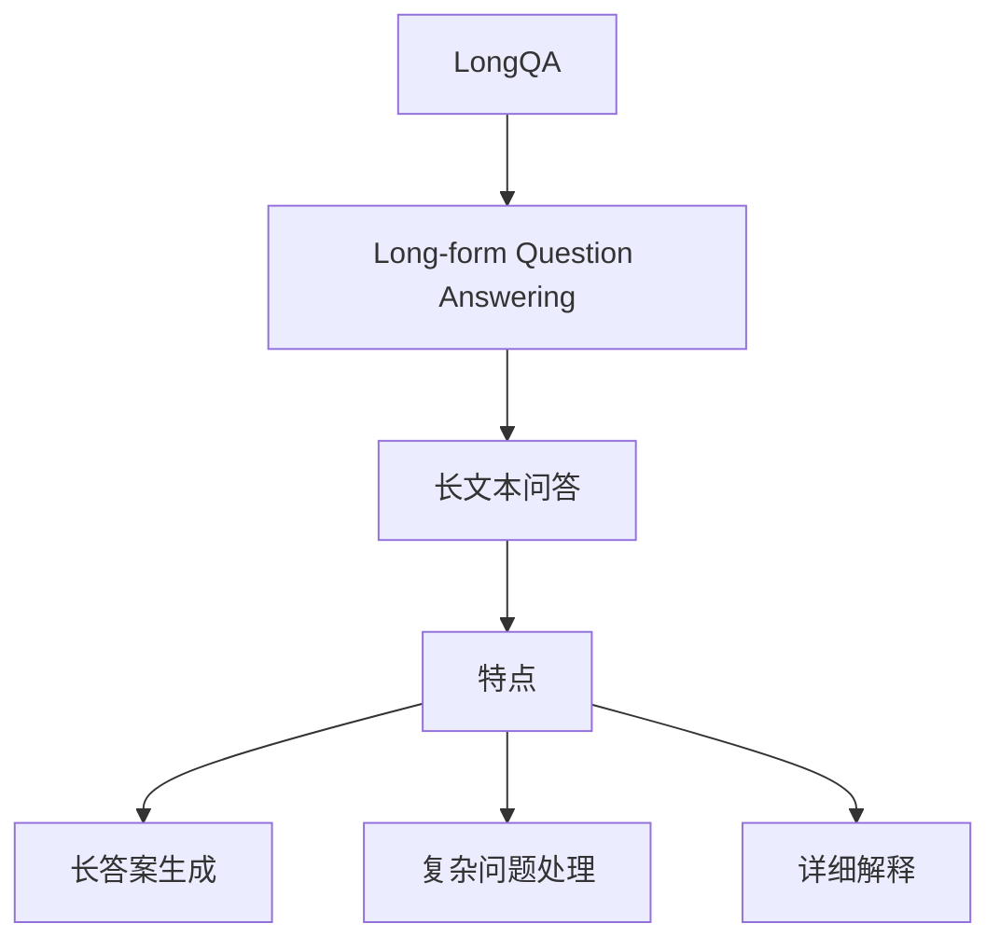

1. ICL (In-Context Learning):

```mermaid
flowchart TD
    A[ICL] --> B[In-Context Learning]
    B --> C[上下文学习]
    
    C --> D[特点]
    D --> D1[使用示例学习]
    D --> D2[无需微调]
    D --> D3[Few-shot学习]
```

2. Recall (Information Retrieval Recall):

```mermaid
flowchart TD
    A[Recall] --> B[Information Retrieval Recall]
    B --> C[信息检索召回]
    
    C --> D[特点]
    D --> D1[文档检索]
    D --> D2[相关性排序]
    D --> D3[召回率评估]
```

3. LongQA (Long-form Question Answering):

```mermaid
flowchart TD
    A[LongQA] --> B[Long-form Question Answering]
    B --> C[长文本问答]
    
    C --> D[特点]
    D --> D1[长答案生成]
    D --> D2[复杂问题处理]
    D --> D3[详细解释]
```

主要区别：
- ICL: 关注上下文示例学习能力
- Recall: 关注文档检索和召回能力
- LongQA: 关注长文本问答和解释能力
