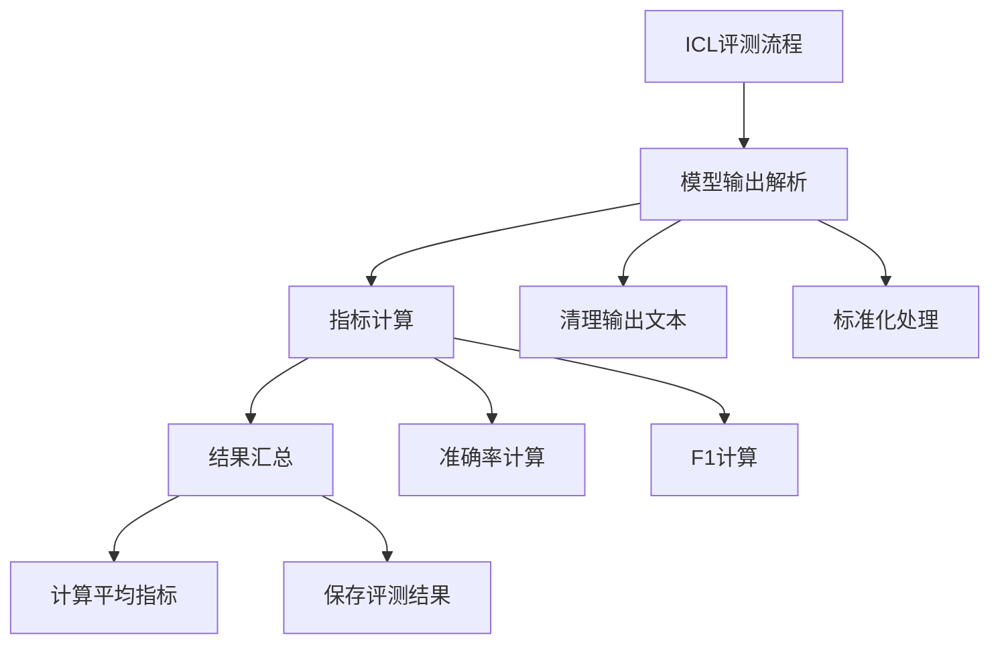

  
ICL (In-Context Learning):

ICL 的评测执行逻辑：



1. 后处理函数结构：
```python
def post_process(output, example):
    """ICL评测的后处理函数"""
    # 1. 获取预测和真实答案
    prediction = output["output"]
    answer = example["answer"]
    
    # 2. 基础指标计算
    metrics = calculate_metrics(prediction, answer)
    
    # 3. 尝试解析和重新计算
    parsed_pred = parse_output(prediction)
    if parsed_pred is not None:
        new_metrics = calculate_metrics(parsed_pred, answer)
        # 取最好的结果
        metrics = {k: max(v, new_metrics[k]) 
                  for k, v in metrics.items()}
    
    return metrics, {"parsed_output": parsed_pred}
```

2. 指标计算：
```python
def calculate_metrics(prediction, answer):
    """计算评估指标"""
    # 标准化处理
    pred = normalize_answer(prediction)
    ans = normalize_answer(answer)
    
    metrics = {
        # 精确匹配
        "exact_match": int(pred == ans),
        
        # F1分数
        "f1": compute_f1(pred, ans),
        
        # 其他可能的指标
        "length": len(pred)
    }
    
    return metrics
```

3. 标准化处理：
```python
def normalize_answer(text):
    """标准化答案文本"""
    if text is None:
        return ""
        
    # 1. 转小写
    text = text.lower()
    
    # 2. 移除标点
    text = remove_punctuation(text)
    
    # 3. 移除多余空格
    text = " ".join(text.split())
    
    return text
```

4. F1分数计算：
```python
def compute_f1(pred, answer):
    """计算F1分数"""
    # 分词
    pred_tokens = pred.split()
    answer_tokens = answer.split()
    
    # 计算重叠
    common = Counter(pred_tokens) & Counter(answer_tokens)
    overlap = sum(common.values())
    
    # 计算精确率和召回率
    precision = overlap / len(pred_tokens) if pred_tokens else 0
    recall = overlap / len(answer_tokens) if answer_tokens else 0
    
    # 计算F1
    f1 = 2 * precision * recall / (precision + recall) if (precision + recall) else 0
    
    return f1
```

5. 结果汇总：
```python
def aggregate_results(all_metrics):
    """汇总所有样本的评测结果"""
    aggregated = {}
    
    # 计算每个指标的平均值
    for metric in all_metrics[0].keys():
        values = [m[metric] for m in all_metrics]
        aggregated[metric] = {
            "mean": np.mean(values),
            "std": np.std(values),
            "min": min(values),
            "max": max(values)
        }
    
    return aggregated
```

6. 评测结果保存：
```python
# 保存详细结果
with open(output_path, "w") as f:
    json.dump({
        "args": args.__dict__,
        "data": results,
        "metrics": metrics,
        "averaged_metrics": averaged_metrics
    }, f, indent=4)

# 保存简化评测分数
with open(output_path + ".score", "w") as f:
    json.dump(averaged_metrics, f, indent=4)
```

ICL评测的特点：
1. 简单直接：直接比对答案
2. 多重指标：EM、F1等多个维度
3. 标准化处理：确保公平比较
4. 结果可复现：保存完整评测信息

需要我详细解释某个具体部分吗？