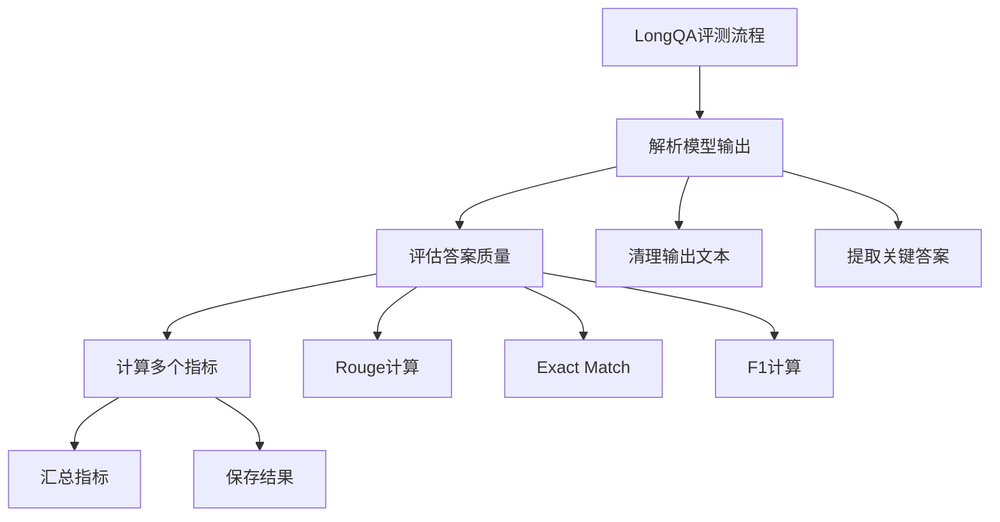

Long-form Question Answering




1. 后处理函数结构：
```python
def post_process(output, example):
    """LongQA评测的后处理函数"""
    # 1. 获取预测和参考答案
    prediction = output["output"]
    reference = example["answer"]
    
    # 2. 清理和标准化
    pred_clean = clean_text(prediction)
    ref_clean = clean_text(reference)
    
    # 3. 计算多个评估指标
    metrics = {
        # Rouge分数
        "rouge": compute_rouge_scores(pred_clean, ref_clean),
        
        # 精确匹配
        "exact_match": compute_exact_match(pred_clean, ref_clean),
        
        # F1分数
        "f1": compute_f1_score(pred_clean, ref_clean)
    }
    
    return metrics, {"cleaned_output": pred_clean}
```


2. Rouge评分计算：
```python
def compute_rouge_scores(prediction, reference):
    """计算Rouge分数"""
    scorer = rouge_scorer.RougeScorer(
        ['rouge1', 'rouge2', 'rougeL'], 
        use_stemmer=True
    )
    
    # 计算各种Rouge分数
    scores = scorer.score(reference, prediction)
    
    return {
        "rouge1": scores['rouge1'].fmeasure,
        "rouge2": scores['rouge2'].fmeasure,
        "rougeL": scores['rougeL'].fmeasure
    }
```


3. 文本清理和标准化：
```python
def clean_text(text):
    """清理和标准化文本"""
    if text is None:
        return ""
        
    # 1. 基础清理
    text = text.strip()
    text = text.replace("\n", " ")
    
    # 2. 移除多余空格
    text = " ".join(text.split())
    
    # 3. 特殊处理
    text = text.replace("<|im_end|>", "")
    
    return text
```


4. 评估指标计算：
```python
def compute_metrics(prediction, reference):
    """计算综合评估指标"""
    # 1. Rouge分数
    rouge_scores = compute_rouge_scores(prediction, reference)
    
    # 2. 精确匹配
    em_score = compute_exact_match(prediction, reference)
    
    # 3. F1分数
    f1_score = compute_f1_score(prediction, reference)
    
    # 4. 长度相关指标
    length_metrics = {
        "pred_len": len(prediction.split()),
        "ref_len": len(reference.split())
    }
    
    return {
        **rouge_scores,
        "exact_match": em_score,
        "f1": f1_score,
        **length_metrics
    }
```


5. 结果保存格式：
```python
{
    "metrics": {
        "rouge1": 0.45,
        "rouge2": 0.25,
        "rougeL": 0.40,
        "exact_match": 0,
        "f1": 0.55,
        "pred_len": 150,
        "ref_len": 180
    },
    "cleaned_output": "清理后的预测文本",
    "parsed_output": "解析后的答案"
}
```


6. LongQA评测的特点：

```python
# 1. 长文本特殊处理
def handle_long_text(text):
    """处理长文本的特殊逻辑"""
    # 分段处理
    segments = split_into_segments(text)
    # 合并结果
    return merge_segments(segments)

# 2. 多维度评估
metrics = {
    "content": rouge_scores,  # 内容相关性
    "length": length_stats,   # 长度统计
    "quality": quality_metrics  # 质量指标
}
```


7. 评测重点：
- 答案完整性
- 内容相关性
- 生成质量
- 长度合适性

需要我详细解释某个具体部分吗？