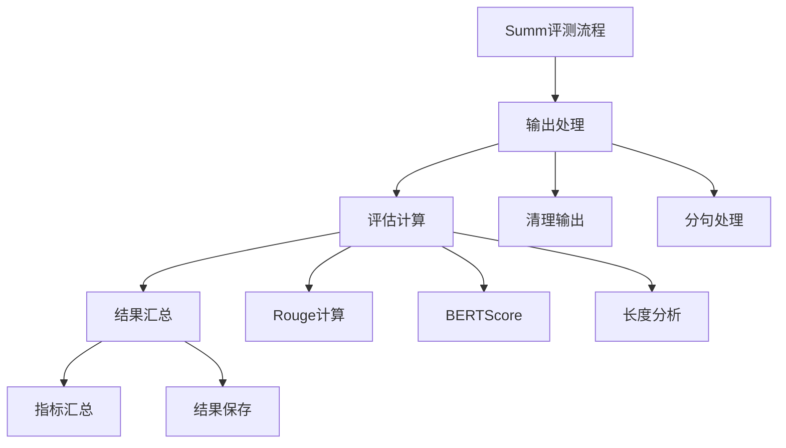

 Summarization (文本摘要) 的评测执行逻辑：




1. 后处理函数结构：
```python
def post_process(output, example):
    """Summ任务的后处理评测"""
    # 1. 获取预测和参考摘要
    prediction = output["output"]
    reference = example["summary"]  # 参考摘要
    
    # 2. 文本清理
    pred_clean = clean_summary(prediction)
    ref_clean = clean_summary(reference)
    
    # 3. 计算评估指标
    metrics = calculate_summary_metrics(
        prediction=pred_clean,
        reference=ref_clean
    )
    
    return metrics, {"cleaned_output": pred_clean}
```


2. Rouge评分计算：
```python
def calculate_rouge_scores(prediction, reference):
    """计算Rouge分数"""
    scorer = rouge_scorer.RougeScorer(
        ['rouge1', 'rouge2', 'rougeL'], 
        use_stemmer=True
    )
    
    scores = scorer.score(reference, prediction)
    
    return {
        "rouge1_f": scores['rouge1'].fmeasure,
        "rouge1_p": scores['rouge1'].precision,
        "rouge1_r": scores['rouge1'].recall,
        "rouge2_f": scores['rouge2'].fmeasure,
        "rougeL_f": scores['rougeL'].fmeasure
    }
```


3. 文本清理：
```python
def clean_summary(text):
    """清理摘要文本"""
    if text is None:
        return ""
    
    # 1. 基础清理
    text = text.strip()
    text = text.replace("\n", " ")
    
    # 2. 移除特殊标记
    text = text.replace("<|im_end|>", "")
    text = text.replace("[SUM]", "")
    
    # 3. 分句处理
    sentences = sent_tokenize(text)
    text = " ".join(sentences)
    
    return text
```


4. 综合指标计算：
```python
def calculate_summary_metrics(prediction, reference):
    """计算摘要评估指标"""
    metrics = {}
    
    # 1. Rouge分数
    rouge_scores = calculate_rouge_scores(prediction, reference)
    metrics.update(rouge_scores)
    
    # 2. 长度统计
    metrics.update({
        "pred_len": len(prediction.split()),
        "ref_len": len(reference.split()),
        "compression_ratio": len(prediction.split()) / 
                           len(reference.split())
    })
    
    # 3. 可选：BERTScore
    if USE_BERT_SCORE:
        bert_scores = calculate_bert_score(prediction, reference)
        metrics.update(bert_scores)
    
    return metrics
```


5. 评测结果示例：
```python
{
    "metrics": {
        "rouge1_f": 0.45,
        "rouge2_f": 0.25,
        "rougeL_f": 0.40,
        "pred_len": 100,
        "ref_len": 150,
        "compression_ratio": 0.67,
        "bert_score_f": 0.85
    },
    "cleaned_output": "清理后的摘要文本"
}
```


6. 特殊处理：
```python
# 1. 分句处理
def process_sentences(text):
    """处理摘要的句子"""
    sentences = sent_tokenize(text)
    # 去重
    unique_sents = list(dict.fromkeys(sentences))
    return " ".join(unique_sents)

# 2. 长度控制
def check_length_constraints(summary, min_len=50, max_len=200):
    """检查摘要长度是否符合要求"""
    words = summary.split()
    return {
        "length_ok": min_len <= len(words) <= max_len,
        "word_count": len(words)
    }
```


7. 评测重点：
- 内容覆盖度（Rouge分数）
- 语义相似度（BERTScore）
- 压缩比
- 摘要长度
- 句子完整性

8. 评测特点：
```python
# 多维度评估
metrics = {
    # 内容相关
    "content_coverage": rouge_scores,
    
    # 语义相关
    "semantic_similarity": bert_scores,
    
    # 长度相关
    "length_stats": {
        "compression": compression_ratio,
        "length_appropriate": length_check
    }
}
```

需要我详细解释某个具体部分吗？