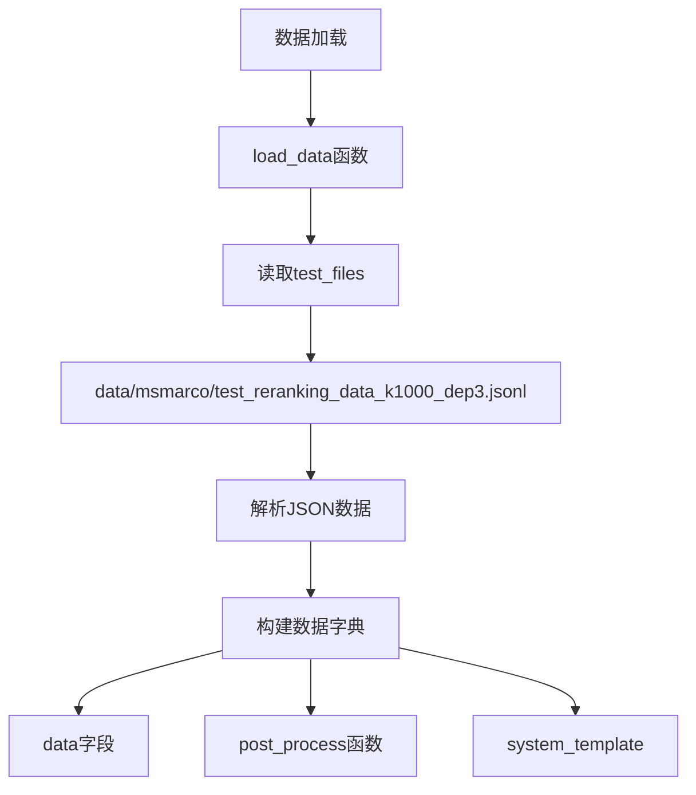

test_data 是从测试文件中加载的。对于 rerank 任务，根据配置文件：

```yaml:configs/rerank.yaml
test_files: data/msmarco/test_reranking_data_k1000_dep3.jsonl
```

数据加载流程：



具体代码流程：

1. 数据加载调用：
```python:eval.py
# 在run_test函数中
data = load_data(args, dataset, test_file, demo_file)
```

2. 数据文件位置：
```
project_root/
    └── data/
        └── msmarco/
            ├── test_reranking_data_k1000_dep3.jsonl  # 测试数据
            └── test_reranking_data_k10_dep3.jsonl    # 示例数据
```

3. 数据文件格式 (JSONL):
```jsonl
{"qid": "1", "query": "...", "candidates": [...], ...}
{"qid": "2", "query": "...", "candidates": [...], ...}
...
```

test_data 就是从这些 JSONL 文件中加载的数据，然后在整个评测过程中被使用。

需要我详细解释数据加载过程或文件格式吗？