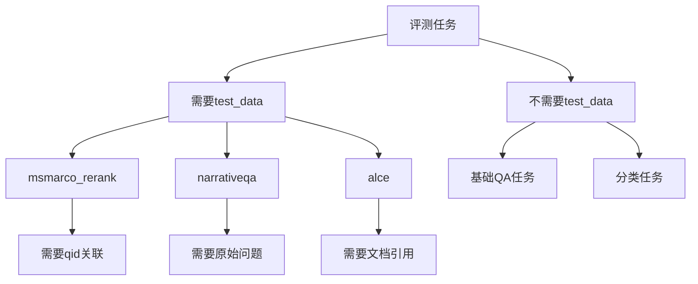

![[需要用到test_data的用例集-20241114003407508.webp]]


1. msmarco_rerank:   rerank 
```python
def post_process(output, test_item):
    # 需要test_item中的qid来关联qrels
    qid = test_item['qid']
    parsed_pred = parse_rankings(output["output"])
    metrics = calculate_retrieval_metrics(
        {qid: parsed_pred}, 
        qrels,
        k_values
    )
```

2. narrativeqa: longqa
```python
def post_process(output, test_item):
    # 需要test_item中的原始问题和上下文
    question = test_item['question']
    context = test_item['context']
    # 评估生成答案的质量
```

3. alce: cite 
```python
def post_process(output, test_item):
    # 需要test_item中的文档信息来验证引用
    docs = test_item['docs']
    # 评估引用准确性和生成质量
```

4. 基础QA任务:
```python
def default_post_process(output, example):
    # 只需要answer字段，不需要其他test_data信息
    prediction = output["output"]
    answer = example["answer"]
    metrics = calculate_metrics(prediction, answer)
```

主要区别：
1. 需要test_data的任务：
   - 需要额外上下文信息
   - 需要ID关联
   - 需要复杂评估逻辑

2. 不需要test_data的任务：
   - 简单的答案匹配
   - 直接的分类评估
   - 标准指标计算
